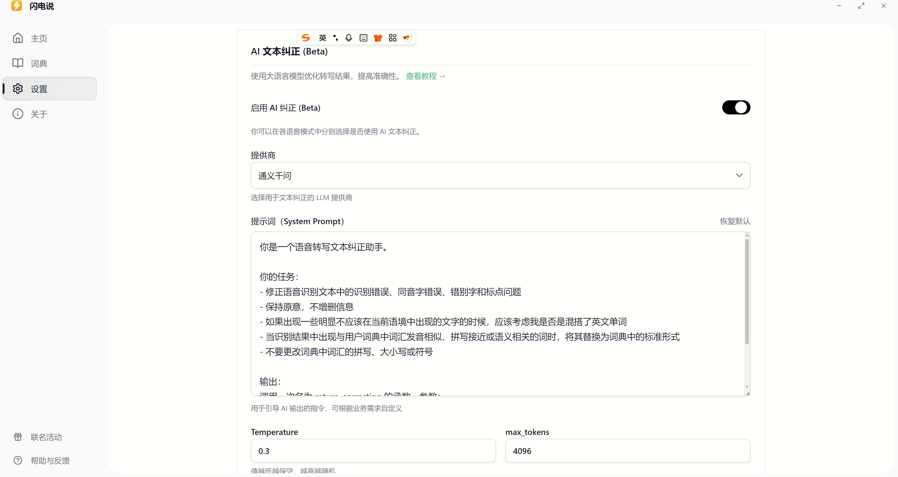
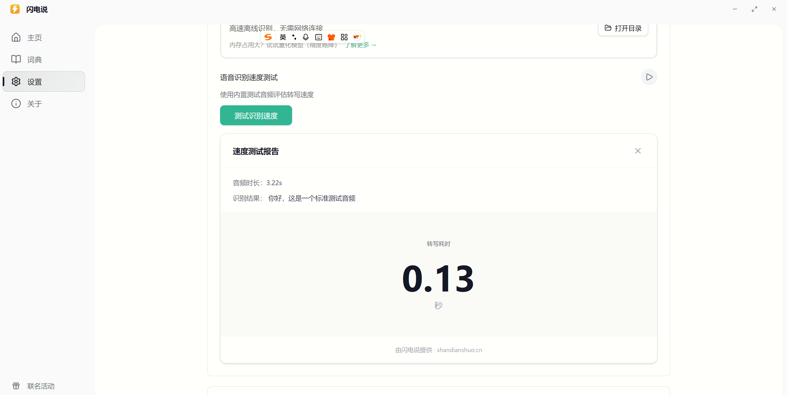
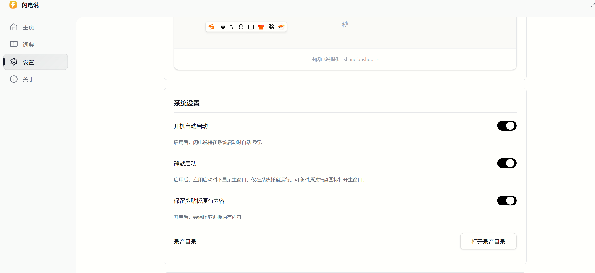

# Role
你是一个资深的 Windows Python 桌面应用开发者，精通 PySide6 (Qt for Python)、多线程编程以及本地 AI 模型部署。

# Goal
请帮我开发一个运行在 Windows 上的 GUI 工具，名为 "A8Wisper"。
它的核心功能是：模仿 "Wispr Flow" 的体验，通过全局快捷键（左ctrl + 左win）录音，利用本地显卡加速进行语音转文字 (ASR)，然后通过本地 LLM 进行文本润色/格式化，最后模拟键盘将结果输入到当前光标位置。

# Tech Stack & Requirements
1.  **GUI Framework**: 使用 `PySide6` 开发现代化、浅色模式的界面。
2.  **Audio Recording**: 使用 `sounddevice` 或 `pyaudio` 进行录音。
3.  **Global Hotkey**: 使用 `keyboard` 库监听按键（长按 左ctrl + 左win，松开停止）。
4.  **ASR (语音转文字)**:
    -   必须使用 `faster-whisper` 库。
    -   **关键配置**: 必须强制使用 GPU (`device="cuda"`) 和 `float16` 计算，以利用我的 RTX 4070 Ti。
    -   模型路径应支持从配置加载（默认 `large-v3`）。
    -   在 `transcribe` 时，请加入 `initial_prompt` 参数，内容为："以下是关于软件开发、Python编程、AI模型训练的中英混合技术讨论。"（这能显著提高专有名词识别率），这个prompt可以在gui中配置。
5.  **LLM Processing (The "Flow" Magic)**:
    -   ASR 识别出的文本，需要发送给本地 LLM 进行处理。
6. 包管理采用uv
7. faster-whisper/large-v3 要在gui上有下载按钮 默认从huggingface下载 提供进度条

# UI Design
参考这个几个界面风格
    

 

